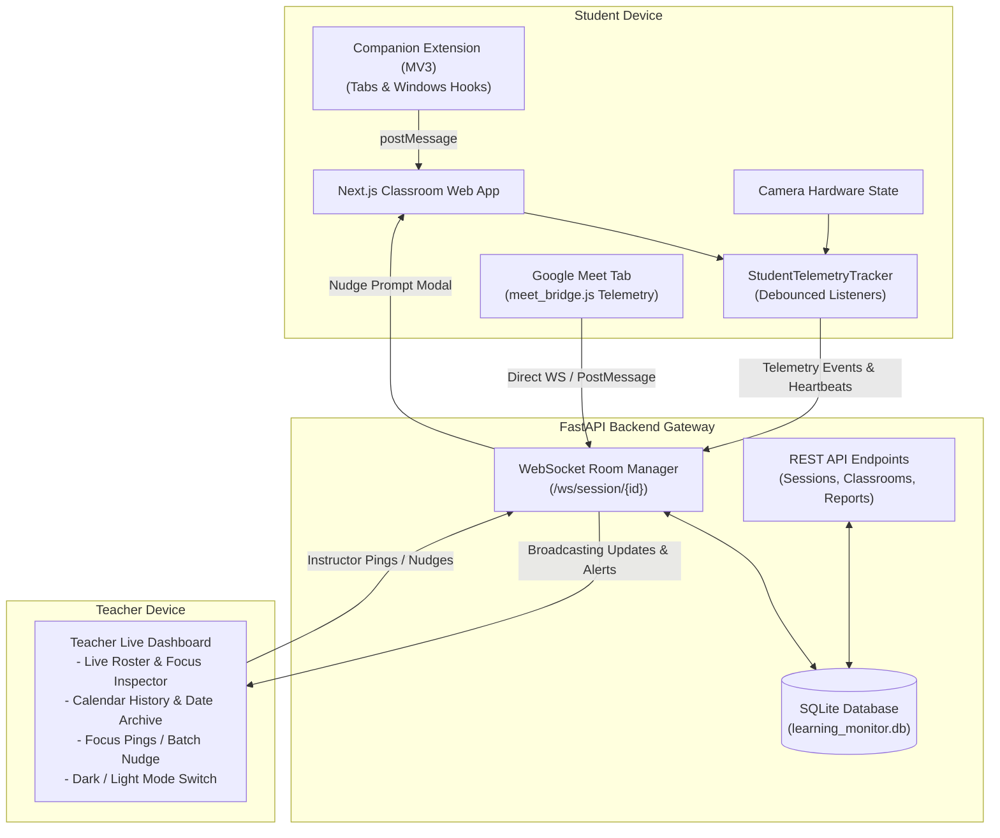

# 🎓 ClassPulse — Privacy-First Student Learning Monitoring System

[](https://fastapi.tiangolo.com)
[](https://nextjs.org)
[](https://react.dev)
[](https://developer.mozilla.org/en-US/docs/Web/API/WebSockets_API)
[](https://tailwindcss.com)
[](#-universal-dark--light-mode)
[](https://meet.google.com)
[](#-privacy--ethical-framework)

A **privacy-first, real-time classroom telemetry system** that monitors student engagement, inactivity, and external browser distractions **without invasive biometric facial AI or continuous video streaming**. Includes native **Google Meet telemetry**, **calendar-based historical session archiving**, a **universal dark/light mode**, and one-click **CSV/Excel report exports**.

---

## 📑 Table of Contents
- [Key Features](#-key-features)
- [Telemetry & Detection Rules](#-telemetry--detection-rules)
- [System Architecture](#-system-architecture)
- [Tech Stack](#-tech-stack)
- [Project Directory Structure](#-project-directory-structure)
- [Quick Start Guide](#-quick-start-guide)
  - [Option A: One-Click Live Session (Recommended)](#option-a-one-click-live-session-recommended)
  - [Option B: Manual Setup](#option-b-manual-setup)
  - [Option C: Docker Containerization](#option-c-docker-containerization-production--multi-platform)
  - [Seeding Historical Sessions & Dates](#seeding-historical-sessions--dates)
- [Universal Dark & Light Mode](#-universal-dark--light-mode)
- [Session History & Calendar Archive](#-session-history--calendar-archive)
- [Google Meet Companion Extension](#-google-meet-companion-extension)
- [Testing & Demo Walkthrough](#-testing--demo-walkthrough)
- [API & WebSocket Protocol](#-api--websocket-protocol)
- [Privacy & Ethical Framework](#-privacy--ethical-framework)
- [Phase Documentation](#-phase-documentation)
- [License](#-license)

---

## 🚀 Key Features

* **⚡ Real-Time Teacher Live Dashboard:** Sub-second WebSocket telemetry displays student status badges (🟢 Active, 🟡 Idle, 🟠 Tab Away, 🔴 Off-Screen / Window Blur), camera hardware state, and Google Meet participation.
* **🌓 Universal Dark & Light Mode:** Seamlessly switch between a crisp white canvas (`#f8fafc` / `#ffffff`) with navy accents and a deep midnight navy dark mode (`#060b18` / `#0b1328`), complete with tactile micro-interactions and anti-FOUC persistence.
* **📅 Historical Session Archive by Calendar Date:** Full lecture archive with interactive calendar date quick-pills (e.g. *Oct 08*, *Oct 07*, *Oct 06*). View past session reports by date with strict data isolation (zero summary bleed).
* **🤝 Google Meet Cross-Tab Telemetry:** Track students directly inside Google Meet sessions via the companion extension (`meet_bridge.js`) without switching tabs.
* **🛡️ Non-Intrusive Inactivity Tracking:** Detects active participation using debounced mouse, keyboard, touch, and scroll interactions with a 5-minute inactivity threshold.
* **🌐 Tab & External Browser Detection:** Detects when students navigate away or focus on other applications using HTML5 Page Visibility APIs and Manifest V3 extension hooks.
* **📹 Hardware Camera State Visibility:** Reflects whether a student's webcam is turned ON or OFF by inspecting hardware media track states—**zero video frames are recorded or processed**.
* **🔔 Live Focus Pings / Batch Nudge:** Teachers can send individual focus check-ins or click **Ping All Inattentive** to alert all distracted students at once.
* **📑 One-Click CSV & Formatted Excel (.xlsx) Export:** Download detailed session reports complete with classroom metadata, KPI summaries, exact attendance metrics, and color-coded engagement badges.

---

## ⏱️ Telemetry & Detection Rules

| Rule | Detection Engine | Grace Period / Threshold | Teacher Dashboard Display |
| :--- | :--- | :--- | :--- |
| **Active Status** | Mouse move, keydown, scroll, or touch input inside the classroom portal | Reset on any input event | 🟢 **ACTIVE** |
| **Inactivity / Idle** | Debounced interaction timer | **5 minutes (300s)** without input | 🟡 **IDLE (> 5m)** |
| **Tab Switched** | HTML5 Page Visibility API (`document.hidden`) + Extension hooks | **5 seconds** grace period | 🟠 **TAB AWAY (> 5s)** |
| **Window Blurred** | `window.onblur` + Extension `chrome.windows.onFocusChanged` | **10 seconds** grace period | 🔴 **OFF-SCREEN (> 10s)** |
| **Google Meet Active** | Companion extension DOM observer on Google Meet tabs | Sub-second sync | 🟢 **Google Meet** badge |
| **Camera State** | Hardware `MediaStreamTrack` live/enabled inspection | Instantaneous | 📹 **Cam ON** / 🚫 **Cam OFF** |
| **Biometric Face AI** | **Explicitly Omitted** | Zero biometrics | No video streaming or recording |

> [!NOTE]
> The **5-second** and **10-second** grace periods prevent false alarms triggered by accidental clicks, system notifications, or quick browser window adjustments.

---

## 🏛️ System Architecture



---

## 💻 Tech Stack

### Backend
* **Language & Framework:** Python 3.10+ / FastAPI
* **Real-Time Communication:** Native Async WebSockets (`websockets`)
* **Database & ORM:** SQLAlchemy with SQLite (default local) and PostgreSQL compatibility
* **Spreadsheet Reporting:** `openpyxl` (styled `.xlsx`) and RFC 4180 UTF-8 BOM CSV exports
* **Security & Auth:** JWT tokens (`python-jose`) and salted hashing

### Frontend
* **Framework:** Next.js 16 (App Router, Turbopack)
* **Library:** React 19 + TypeScript
* **Styling:** Tailwind CSS v4 with custom dark mode variants (`@variant dark`)
* **Design Philosophy:** Tactile micro-interactions (Emil Kowalski pressable physics) & high craft layout
* **Icons:** Lucide React

### Companion Browser Extension
* **Standard:** Google Chrome & Microsoft Edge **Manifest V3**
* **Permissions:** `tabs`, `windows`, `idle`, `storage`
* **Google Meet Support:** Dedicated `meet_bridge.js` content script

---

## 📂 Project Directory Structure

```
student-monitoring-system/
├── backend/
│   ├── app/
│   │   ├── main.py                 # FastAPI application entry & router registration
│   │   ├── websocket_manager.py    # Real-time room manager & event broadcaster
│   │   ├── models.py               # SQLAlchemy ORM models (Session, Attendance, Classroom)
│   │   ├── schemas.py              # Pydantic validation schemas
│   │   ├── config.py               # App configuration & database URL resolution
│   │   └── routers/
│   │       ├── ws.py               # WebSocket telemetry streaming endpoint
│   │       ├── sessions.py         # Session management, history, CSV & Excel exports
│   │       ├── classrooms.py       # Classroom management & join codes
│   │       └── auth.py             # User registration & authentication
│   ├── seed_dates.py               # Historical multi-date session generator
│   ├── requirements.txt            # Python dependencies (fastapi, uvicorn, openpyxl, etc.)
│   └── run.py                      # Backend launcher
├── frontend/
│   ├── src/
│   │   ├── app/
│   │   │   ├── page.tsx            # Landing page with hero & feature overview
│   │   │   ├── teacher/page.tsx    # Teacher Dashboard (Live Monitor + Calendar History)
│   │   │   ├── classroom/[sessionId]/page.tsx # Student Classroom Portal & Webcam Monitor
│   │   │   ├── report/[sessionId]/page.tsx    # Attendance Summary & Date Report
│   │   │   ├── globals.css         # Tailwind v4 styles, dark tokens, and pressable physics
│   │   │   └── layout.tsx          # Root layout with anti-FOUC theme script
│   │   ├── components/
│   │   │   └── ThemeToggle.tsx     # Tactile Light/Dark mode toggle switch
│   │   └── lib/
│   │       ├── telemetry.ts        # Client-side telemetry engine & grace timers
│   │       └── api.ts              # API & WebSocket client functions
│   ├── package.json
│   └── next.config.ts              # Next.js Turbopack configuration
├── extension/                      # Manifest V3 companion extension
│   ├── manifest.json
│   ├── background.js               # Service worker for cross-tab tracking
│   ├── bridge.js                   # Web app content script DOM bridge
│   ├── meet_bridge.js              # Dedicated Google Meet telemetry observer
│   ├── popup.html                  # Extension status popup UI
│   └── popup.js                    # Extension popup logic
├── scripts/
│   └── simulate_classroom.py       # Multi-student classroom simulator script
├── tests/
│   ├── test_e2e_ws.py              # E2E WebSocket & Batch Nudge integration test
│   └── test_exports.py             # CSV and Excel export verification tests
├── start_live_session.bat          # One-click Windows Live Session launcher
├── start_live_session.ps1          # PowerShell Live Session launcher
├── run-system.bat                  # One-click native stack launcher
├── run-docker.bat                  # One-click Docker container launcher
└── README.md
```

---

## ⚡ Quick Start Guide

### Prerequisites
* **Python 3.10+**
* **Node.js 18+** & **npm**

---

### Option A: One-Click Live Session (Recommended)
Double-click or run from PowerShell:
```powershell
.\start_live_session.bat
```
*(Or `.\start_live_session.ps1`)*

This script automatically:
1. Validates the Python virtual environment and installs dependencies if needed.
2. Starts the **FastAPI backend** on port `8000`.
3. Starts the **Next.js frontend** on port `3000`.
4. Launches the **Teacher Dashboard** and a **Student Classroom View** in your default browser.

---

### Option B: Manual Setup

#### 1. Setup & Launch Backend
```powershell
# From project root:
cd backend

# Create and activate virtual environment (if not already created)
python -m venv ..\.venv
..\.venv\Scripts\activate

# Install dependencies
pip install -r requirements.txt

# Start backend server
python -m uvicorn app.main:app --host 0.0.0.0 --port 8000 --reload
```
* **API Documentation (Swagger UI):** `http://localhost:8000/docs`

#### 2. Setup & Launch Frontend
```powershell
# In a new terminal, from project root:
cd frontend

# Install dependencies
npm install

# Start Next.js development server
npm run dev
```
* **Web Application:** `http://localhost:3000`

---

### Option C: Docker Containerization (Production / Multi-Platform)

```powershell
# Build and start all services in detached mode
docker compose up --build -d
```
* **Teacher Dashboard:** `http://localhost:3000/teacher`
* **Backend API:** `http://localhost:8000/docs`

---

### Seeding Historical Sessions & Dates

To populate your local database with realistic historical lectures across multiple dates:
```powershell
.venv\Scripts\python.exe backend/seed_dates.py
```
This generates sample sessions for:
* **Thu, Oct 08, 2026:** *Lecture 5: Advanced Graph Algorithms & Tree Traversal* (16 students)
* **Wed, Oct 07, 2026:** *Lecture 4: Google Meet Telemetry & Roster Sync* (18 students)
* **Tue, Oct 06, 2026:** *Lecture 3: Asynchronous State & Real-Time Sync* (15 students)
* **Mon, Oct 05, 2026:** *Lecture 2: Privacy-Preserving Classroom Observability* (17 students)

---

## 🌓 Universal Dark & Light Mode

ClassPulse includes a first-class dark mode designed for long lecture sessions:

* **Header Toggle Button:** Located in the top-right header across every page (Teacher, Report, Student Classroom, and Landing Page).
* **Light Palette:** Clean white canvas (`#f8fafc` / `#ffffff`) with crisp typography and midnight navy structural grounding (`#0a152d`).
* **Dark Palette:** Deep midnight navy backgrounds (`#060b18`, `#0b1328`, `#0e172e`) with hairline borders (`border-white/10`) and vibrant royal blue accents (`#2563eb`).
* **Anti-FOUC:** Pre-hydration script in `<head>` checks `localStorage.getItem('classpulse-theme')` immediately to eliminate white flashes on dark mode page loads.
* **Physics & Micro-Interactions:** Built with Emil Kowalski `.pressable` button scaling and icon rotation.

---

## 📅 Session History & Calendar Archive

Teachers have access to all completed sessions organized by calendar date:

1. On the Teacher Dashboard, switch to the **"Session History & Dates"** tab (or visit `http://localhost:3000/teacher?tab=history`).
2. Use the **Date Quick-Pills** across the top to filter by calendar date.
3. Each session tile displays:
   * Calendar badge with date and lecture title.
   * Total students, average engagement score, and duration.
   * **View Summary & Report** button leading to `/report/[sessionId]`.
   * Direct **Export CSV** and **Export Excel (.xlsx)** buttons.
4. **Data Isolation:** Every session operates under a dedicated `session_id`. Starting a new live session initializes a clean roster so historical attendance records never bleed into new sessions.

---

## 🧩 Google Meet Companion Extension

For classes conducted in Google Meet:

1. Open Google Chrome or Microsoft Edge and navigate to `chrome://extensions/` (or `edge://extensions/`).
2. Toggle on **Developer mode** in the top-right corner.
3. Click **"Load unpacked"** and select the [`extension/`](extension/) directory.
4. When a student enters Google Meet (`https://meet.google.com`), `meet_bridge.js` automatically:
   * Observes audio/video toggle states directly from Google Meet buttons.
   * Reports presence to the teacher dashboard via WebSocket synchronization.
   * Displays the emerald **Google Meet** badge on the teacher roster.

---

## 🧪 Testing & Demo Walkthrough

1. **Launch Stack:** Run `.\start_live_session.bat` or navigate to [http://localhost:3000/teacher](http://localhost:3000/teacher).
2. **Open Student View:** Navigate to [http://localhost:3000/classroom/live-demo](http://localhost:3000/classroom/live-demo) in another tab or window.
3. **Verify Active Status:** The student (**Alex Chen**) appears in the teacher roster with 🟢 **ACTIVE**.
4. **Test Tab Away (5s Grace Period):** Switch to another browser tab in the student window. After 5 seconds, status transitions to 🟠 **TAB AWAY (> 5s)**.
5. **Test Window Blur (10s Grace Period):** Focus another desktop app (e.g., File Explorer) for $> 10$ seconds. Status transitions to 🔴 **OFF-SCREEN (> 10s)**.
6. **Test Fast Idle Simulation:** Click **"Trigger 10s Fast Idle"** on the student page and don't move the mouse. In 10 seconds, status transitions to 🟡 **IDLE**. Any input immediately restores 🟢 **ACTIVE**.
7. **Test Focus Ping / Nudge:** On the teacher dashboard, select the student and click **"Send Focus Check-In Prompt"**. A modal immediately appears on the student's screen.
8. **Test Dark Mode Toggle:** Click the Sun/Moon icon in the top header to toggle between light and dark modes across the app.
9. **Browse Session Dates:** Click **"Session History & Dates"** to inspect historical lecture records and download CSV or Excel reports.

---

## 📡 API & WebSocket Protocol

### REST Endpoints

| Method | Endpoint | Description |
| :--- | :--- | :--- |
| `GET` | `/api/sessions/` | List all historical sessions with attendee counts, duration, and engagement scores |
| `POST` | `/api/sessions/start` | Conclude previous live sessions and start a new clean session |
| `GET` | `/api/sessions/active` | Get current live session details (`active: true/false`) |
| `GET` | `/api/sessions/{session_id}` | Retrieve single session metadata |
| `POST` | `/api/sessions/{session_id}/end` | End a live session and mark as completed |
| `GET` | `/api/sessions/{session_id}/report` | Get detailed attendance report with per-student metrics |
| `GET` | `/api/sessions/{session_id}/export/csv` | Download RFC 4180 UTF-8 BOM CSV report |
| `GET` | `/api/sessions/{session_id}/export/excel` | Download formatted `.xlsx` spreadsheet report |
| `DELETE` | `/api/sessions/{session_id}` | Delete a session and its associated records |

### WebSocket Telemetry (`/ws/session/{sessionId}`)

```json
{
  "event": "telemetry:status_change",
  "sessionId": "session-2026-10-08-lecture-5",
  "timestamp": 1791200000000,
  "payload": {
    "studentId": "alex-chen-uuid",
    "previousStatus": "ACTIVE",
    "newStatus": "TAB_AWAY",
    "reason": "Tab hidden > 5s",
    "cameraOn": true
  }
}
```

---

## 🔒 Privacy & Ethical Framework

* **Zero Facial Biometrics:** No facial landmarking, emotion detection, eye-gaze tracking, or video frame analysis.
* **No Video Recording:** Webcam state is inspected locally via hardware APIs. No video streams are transmitted or saved.
* **No Keylogging:** Keyboard listeners monitor *interaction presence* (`keydown` event timestamps), never *keystroke content*.
* **Transparent Student UI:** Students have real-time visibility into their own focus status, camera status, and idle countdowns.
* **Compliance:** Adheres to **FERPA**, **COPPA**, and **GDPR Article 9** restrictions regarding student privacy.

---

## 📚 Phase Documentation

Detailed engineering specifications are located in the [`docs/`](docs/) directory:
* [Phase 1: Project Scope, Requirements & Telemetry Specification](docs/PHASE_1_SPECIFICATION.md)
* [Phase 2: System Architecture & Technical Design Specification](docs/PHASE_2_ARCHITECTURE.md)
* [Phase 3: Feasibility & Core Proof of Concept Validation](docs/PHASE_3_POC_VALIDATION.md)
* [Phase 4: Core MVP Development Delivery](docs/PHASE_4_MVP_DELIVERY.md)

---

## 📄 License
This project is open-source and available under the [MIT License](LICENSE).
