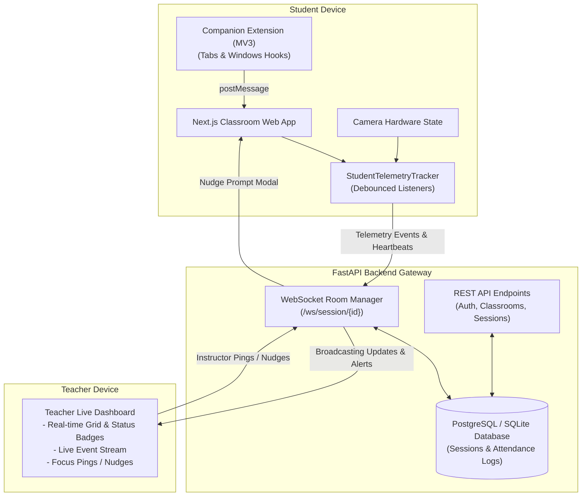

# 🎓 Student Learning Monitoring System

[](https://fastapi.tiangolo.com)
[](https://nextjs.org)
[](https://react.dev)
[](https://developer.mozilla.org/en-US/docs/Web/API/WebSockets_API)
[](https://tailwindcss.com)
[](#-privacy--ethical-framework)

A **privacy-first, real-time learning telemetry system** for online classrooms that monitors student engagement, inactivity, and multi-tab/external browser distractions **without invasive biometric facial AI or continuous video streaming**.

---

## 📌 GitHub Repository Description

> **Privacy-first, real-time telemetry system for online classrooms. Tracks student engagement, inactivity, tab switching, and window focus without biometric surveillance or video streaming.**

*(Character count: 198 — ideal for GitHub's repository "About" field)*

---

## 📑 Table of Contents
- [Key Features](#-key-features)
- [Telemetry & Detection Rules](#-telemetry--detection-rules)
- [System Architecture](#-system-architecture)
- [Tech Stack](#-tech-stack)
- [Project Directory Structure](#-project-directory-structure)
- [Quick Start Guide](#-quick-start-guide)
  - [Option A: One-Click Windows Launcher](#option-a-one-click-windows-launcher-recommended)
  - [Option B: Manual Setup](#option-b-manual-setup)
- [Loading the Companion Browser Extension](#-loading-the-companion-browser-extension)
- [Testing & Demo Walkthrough](#-testing--demo-walkthrough)
- [API & WebSocket Protocol](#-api--websocket-protocol)
- [Privacy & Ethical Framework](#-privacy--ethical-framework)
- [Phase Documentation](#-phase-documentation)

---

## 🚀 Key Features

* **⚡ Real-Time Teacher Live Dashboard:** Displays student presence cards with live status badges (🟢 Active, 🟡 Idle, 🟠 Tab Away, 🔴 Off-Screen / Window Blur) updating via WebSockets in sub-second time.
* **🛡️ Non-Intrusive Inactivity Tracking:** Detects active participation using debounced mouse, keyboard, touch, and scroll interactions with a 5-minute threshold.
* **🌐 Tab & External Browser Detection:** Detects when students navigate to other browser tabs or switch to external applications using HTML5 Page Visibility APIs and an optional Manifest V3 companion extension.
* **📹 Hardware Camera State Visibility:** Reflects whether a student's webcam is turned ON or OFF by inspecting hardware media track states—**zero video frames are recorded or processed**.
* **🔔 Live Focus Pings / Batch Nudge:** Teachers can send individual focus check-ins or click **Ping All Inattentive** to alert all distracted students at once.
* **📊 Post-Session Attendance & Analytics:** Automatically records exact active vs. idle vs. away durations and dynamically calculates student engagement scores.
* **📑 One-Click CSV & Formatted Excel (.xlsx) Export:** Download detailed session reports complete with classroom metadata, KPI summaries, exact attendance metrics, and color-coded engagement badges.

---

## ⏱️ Telemetry & Detection Rules

| Rule | Detection Engine | Grace Period / Threshold | Teacher Dashboard Display |
| :--- | :--- | :--- | :--- |
| **Active Status** | Mouse move, keydown, scroll, or touch input inside the classroom portal | Reset on any input event | 🟢 **ACTIVE** |
| **Inactivity / Idle** | Debounced interaction timer | **5 minutes (300s)** without input | 🟡 **IDLE (> 5m)** |
| **Tab Switched** | HTML5 Page Visibility API (`document.hidden`) + Extension hooks | **5 seconds** grace period | 🟠 **TAB AWAY (> 5s)** |
| **Window Blurred** | `window.onblur` + Extension `chrome.windows.onFocusChanged` | **10 seconds** grace period | 🔴 **OFF-SCREEN (> 10s)** |
| **Camera State** | Hardware `MediaStreamTrack` live/enabled inspection | Instantaneous | 📹 **Cam ON** / 🚫 **Cam OFF** |
| **Biometric Face AI** | **Explicitly Omitted** | Zero biometrics | No video streaming or recording |

> [!NOTE]
> The **5-second** and **10-second** grace periods prevent false alarms triggered by accidental clicks, system notifications, or quick browser window adjustments.

---

## 🏛️ System Architecture



---

## 💻 Tech Stack

### Backend
* **Language & Framework:** Python 3.10+ / FastAPI
* **Real-Time Communication:** Native Async WebSockets (`websockets`)
* **Database & ORM:** SQLAlchemy with SQLite (default local) and PostgreSQL compatibility
* **Spreadsheet Reporting:** `openpyxl` (styled `.xlsx`) and RFC 4180 UTF-8 BOM CSV exports
* **Security & Auth:** JWT tokens (`python-jose`) and salted hashing

### Frontend
* **Framework:** Next.js 16 (App Router, Turbopack)
* **Library:** React 19 + TypeScript
* **Styling:** Tailwind CSS v4
* **Icons:** Lucide React

### Companion Browser Extension
* **Standard:** Google Chrome & Microsoft Edge **Manifest V3**
* **Permissions:** `tabs`, `windows`, `idle`

---

## 📂 Project Directory Structure

```
student-monitoring-system/
├── backend/
│   ├── app/
│   │   ├── main.py                 # FastAPI application & demo data seeder
│   │   ├── websocket_manager.py    # Real-time room manager & event broadcaster
│   │   ├── models.py               # Relational ORM models
│   │   ├── schemas.py              # Pydantic validation schemas
│   │   ├── auth_utils.py           # Password hashing & JWT helpers
│   │   └── routers/
│   │       ├── ws.py               # WebSocket telemetry streaming route
│   │       ├── sessions.py         # Session management & report generator
│   │       ├── classrooms.py       # Classroom management & join codes
│   │       └── auth.py             # User registration & authentication
│   ├── requirements.txt            # Python dependencies
│   └── run.py                      # Backend launcher
├── frontend/
│   ├── src/
│   │   ├── app/
│   │   │   ├── page.tsx            # Main landing page
│   │   │   ├── teacher/page.tsx    # Teacher Live Monitoring Dashboard
│   │   │   ├── classroom/[sessionId]/page.tsx # Student Classroom Portal
│   │   │   └── report/[sessionId]/page.tsx    # Attendance & Engagement Report
│   │   └── lib/
│   │       ├── telemetry.ts        # Client-side telemetry engine
│   │       └── api.ts              # API & WebSocket client
│   └── package.json
├── extension/                      # Manifest V3 companion extension
│   ├── manifest.json
│   ├── background.js               # Service worker for cross-tab tracking
│   ├── bridge.js                   # Content script DOM bridge
│   └── popup.html                  # Extension popup UI
├── poc/                            # Phase 3 standalone visual test harness
├── tests/
│   └── test_e2e_ws.py              # Automated WebSocket integration test
├── docs/                           # Comprehensive phase specification files
│   ├── PHASE_1_SPECIFICATION.md
│   ├── PHASE_2_ARCHITECTURE.md
│   ├── PHASE_3_POC_VALIDATION.md
│   └── PHASE_4_MVP_DELIVERY.md
├── run-system.bat                  # One-click Windows launcher
└── README.md
```

---

## ⚡ Quick Start Guide

### Prerequisites
* **Python 3.10+** installed
* **Node.js 18+** & **npm** installed

---

### Option A: One-Click Windows Launcher (Recommended)
Double-click or run from PowerShell:
```powershell
.\run-system.bat
```
This automatically launches both the **FastAPI backend** (port `8000`) and the **Next.js frontend** (port `3000`) in separate windows.

---

### Option B: Manual Setup

#### 1. Setup & Launch Backend
```powershell
# From project root:
cd backend

# Create and activate virtual environment (if not already done)
python -m venv ..\.venv
..\.venv\Scripts\activate

# Install dependencies
pip install -r requirements.txt

# Start backend server
python -m uvicorn app.main:app --host 0.0.0.0 --port 8000 --reload
```
* API Documentation (Swagger UI): `http://localhost:8000/docs`

#### 2. Setup & Launch Frontend
```powershell
# In a new terminal, from project root:
cd frontend

# Install dependencies
npm install

# Start Next.js development server
npm run dev
```
* Web Application: `http://localhost:3000`

---

## 🧩 Loading the Companion Browser Extension

1. Open Google Chrome or Microsoft Edge and navigate to `chrome://extensions/` (or `edge://extensions/`).
2. Toggle on **Developer mode** in the top-right corner.
3. Click **"Load unpacked"** and select the [`extension/`](file:///d:/Users/Documents/bengit/student-monitoring-system/extension) folder.
4. When you open the student classroom, the extension badge will show:
   ```
   🟢 Extension Verified (v1.0.0)
   ```

---

## 🧪 Testing & Demo Walkthrough

1. **Open Teacher Dashboard:** Navigate to [http://localhost:3000/teacher](http://localhost:3000/teacher). The navbar will display `FEED CONNECTED 🟢`.
2. **Open Student Portal:** Click **"Open Student View"** or navigate to [http://localhost:3000/classroom/live-demo](http://localhost:3000/classroom/live-demo) in a separate window or incognito session.
3. **Verify Student Reflection:** The student (**Alex Chen**) appears immediately on the teacher dashboard with a 🟢 **ACTIVE** badge.
4. **Test Tab Switching (5s Grace Period):** Switch to another tab in the student window. After 5 seconds, the teacher dashboard marks the student as 🟠 **TAB AWAY (> 5s)**. Returning to the tab restores 🟢 **ACTIVE**.
5. **Test Window Blur (10s Grace Period):** Click into another app (e.g., Notepad) for $> 10$ seconds. The dashboard updates to 🔴 **OFF-SCREEN (> 10s)**.
6. **Test Fast Idle (10s):** On the student page, click **"⚡ Test 10s Fast Idle"** and stop interacting. In 10 seconds, status transitions to 🟡 **IDLE**. Moving the mouse immediately restores 🟢 **ACTIVE**.
7. **Test Camera Toggle:** Click **"Turn Camera ON"** on the student page; the teacher dashboard badge instantly updates to 📹 **Cam ON**.
8. **Test Instructor Nudge:** On the teacher dashboard, click **"Ping Student"**. A focus check-in modal appears on the student's screen with an acknowledgement button.
9. **Test Session Report & Spreadsheet Exports:** Click **"End Session & View Report"** to view aggregated attendance, time spent active/away, and final engagement scores. Click **"Export CSV"** or **"Export Excel (.xlsx)"** to download full class reports with styled tables and KPI metrics.

---

## 📡 API & WebSocket Protocol

### Core WebSocket Envelopes (`/ws/session/{sessionId}`)

#### 1. Student Status Change (`telemetry:status_change`)
```json
{
  "event": "telemetry:status_change",
  "sessionId": "live-demo-session",
  "timestamp": 1791200000000,
  "payload": {
    "studentId": "alex-chen-uuid",
    "previousStatus": "ACTIVE",
    "newStatus": "TAB_AWAY",
    "reason": "Tab hidden > 5s",
    "gracePeriodSeconds": 5,
    "cameraOn": true
  }
}
```

#### 2. Teacher Roster Update Broadcast (`teacher:student_updated`)
```json
{
  "event": "teacher:student_updated",
  "sessionId": "live-demo-session",
  "timestamp": 1791200000500,
  "payload": {
    "studentId": "alex-chen-uuid",
    "name": "Alex Chen",
    "currentStatus": "TAB_AWAY",
    "cameraOn": true,
    "extensionActive": true,
    "tabAwayCount": 1,
    "windowBlurCount": 0
  }
}
```

---

## 🔒 Privacy & Ethical Framework

* **Zero Facial Biometrics:** No facial landmarking, emotion detection, eye-gaze tracking, or video frame analysis.
* **No Video Recording:** Video streams are never transmitted, saved, or uploaded to servers.
* **No Keylogging:** Keyboard listeners monitor *interaction presence* (`keydown` event timestamps), never *keystroke content* (`event.key` values are discarded).
* **Transparent Student UI:** Students have real-time visibility into their own focus status, camera status, and grace period countdowns.
* **Compliance:** Fully adheres to **FERPA**, **COPPA**, and **GDPR Article 9** restrictions regarding biometric student data.

---

## 📚 Phase Documentation

Detailed engineering specifications for every project phase are located in the [`docs/`](file:///d:/Users/Documents/bengit/student-monitoring-system/docs) directory:
* [Phase 1: Project Scope, Requirements & Telemetry Specification](file:///d:/Users/Documents/bengit/student-monitoring-system/docs/PHASE_1_SPECIFICATION.md)
* [Phase 2: System Architecture & Technical Design Specification](file:///d:/Users/Documents/bengit/student-monitoring-system/docs/PHASE_2_ARCHITECTURE.md)
* [Phase 3: Feasibility & Core Proof of Concept Validation](file:///d:/Users/Documents/bengit/student-monitoring-system/docs/PHASE_3_POC_VALIDATION.md)
* [Phase 4: Core MVP Development Delivery](file:///d:/Users/Documents/bengit/student-monitoring-system/docs/PHASE_4_MVP_DELIVERY.md)

---

## 📄 License
This project is open-source and available under the [MIT License](LICENSE).
